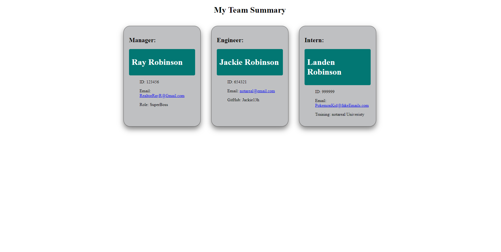

# terminal_team_summarizer

## Description

This is an app built in back-end using ZERO starter code (but helpful hints from the challenge README) that allows users to input Employee information into the terminal and the program will return the employee information into an automatically populated HTML page for the user's convenience.

## Table of Contents

- [Installation](#installation)
- [Screenshot] (#screenshot)
- [Usage](#usage)
- [License](#license)
- [Questions](#questions)
- [How To Contribute](#contributions)
- [Test](#tests)

## Installation

This does not require installation, simply open the integrated terminal in the correct folder and run node index.js. You can visit my GitHub Repository at https://github.com/RayR124?tab=repositories and search for this Summarizer to clone yourself a copy of the working program!

## Screenshot

## Usage

Simply put, this will allow users to add employee information into a database, in a clean, organized, and easy to understand display.

## License

MIT License

Copyright (c) 2023 Raymond Robinson

Permission is hereby granted, free of charge, to any person obtaining a copy
of this software and associated documentation files (the "Software"), to deal
in the Software without restriction, including without limitation the rights
to use, copy, modify, merge, publish, distribute, sublicense, and/or sell
copies of the Software, and to permit persons to whom the Software is
furnished to do so, subject to the following conditions:

The above copyright notice and this permission notice shall be included in all
copies or substantial portions of the Software.

THE SOFTWARE IS PROVIDED "AS IS", WITHOUT WARRANTY OF ANY KIND, EXPRESS OR
IMPLIED, INCLUDING BUT NOT LIMITED TO THE WARRANTIES OF MERCHANTABILITY,
FITNESS FOR A PARTICULAR PURPOSE AND NONINFRINGEMENT. IN NO EVENT SHALL THE
AUTHORS OR COPYRIGHT HOLDERS BE LIABLE FOR ANY CLAIM, DAMAGES OR OTHER
LIABILITY, WHETHER IN AN ACTION OF CONTRACT, TORT OR OTHERWISE, ARISING FROM,
OUT OF OR IN CONNECTION WITH THE SOFTWARE OR THE USE OR OTHER DEALINGS IN THE
SOFTWARE.

## Questions

Here is the link to my GitHub Repository:
https://github.com/RayR124

For additonal questions or comments, please email me at : RealtorRayR@Gmail.com